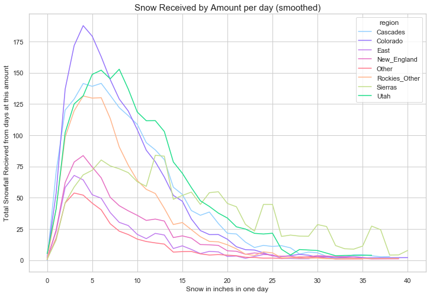
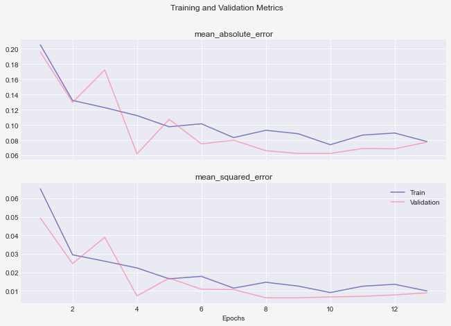
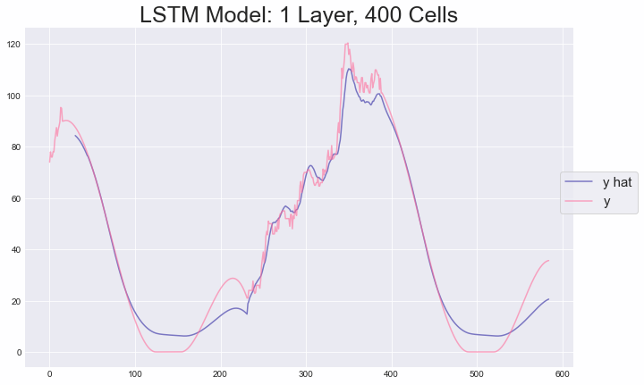
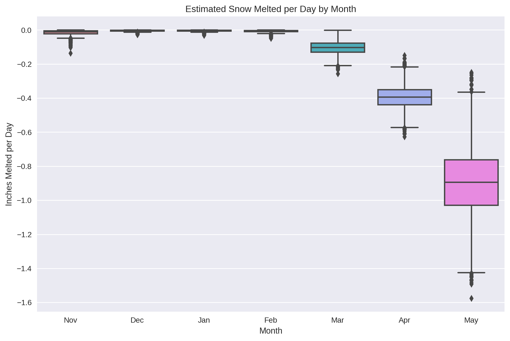
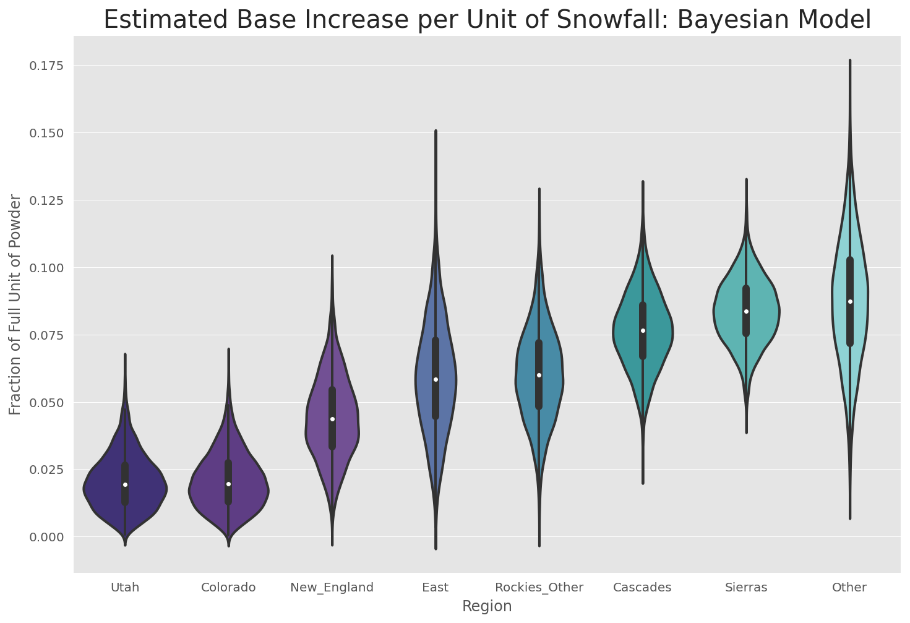
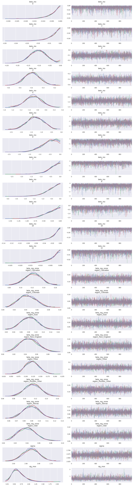
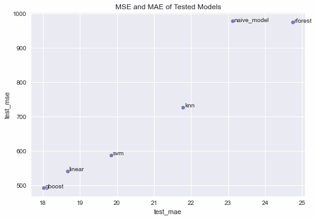
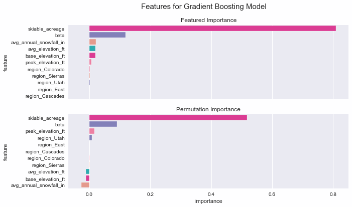
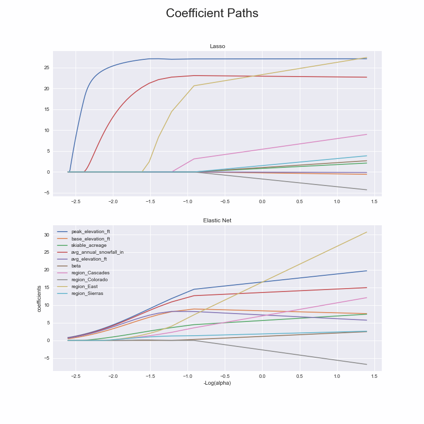

# ski-snow-modeling
Exploring the relationship between ski resort snowfall, base depth, and other features, with an emphasis on time series modeling. 

### Table of Contents
1. [Description of Goals](https://github.com/chrisoyer/ski-snow-modeling/#Description-of-Goals)
1. [Files](https://github.com/chrisoyer/ski-snow-modeling/#Files)
1. [EDA including geographic data](https://github.com/chrisoyer/ski-snow-modeling/#from-eda-including-geographic-data)
1. [Data Cleaning](https://github.com/chrisoyer/ski-snow-modeling/#Data-Cleaning)
1. [Feature Engineering](https://github.com/chrisoyer/ski-snow-modeling/#Feature-Engineering)
1. [Time Series Analysis and ARIMA-style Models](https://github.com/chrisoyer/ski-snow-modeling/#Time-Series-Analysis-and-ARIMA-style-Models)
1. [LSTM Models in Tensorflow](https://github.com/chrisoyer/ski-snow-modeling/#LSTM-Models-in-Tensorflow)
1. [Bayesian Regression with PyStan](https://github.com/chrisoyer/ski-snow-modeling/#Bayesian-Regression-in-PyStan)
1. [Regression Using Engineered Features](https://github.com/chrisoyer/ski-snow-modeling/#Regression-Using-Engineered-Features)
1. [In Progress](https://github.com/chrisoyer/ski-snow-modeling/#In-Progress)

### Description of Goals
EDA to see how ski resort snowfall, season length, base depth, etc. vary by region. Modeling: using altitude, location, etc to predict season length, and time series analysis of base depth evolution.
Tools: Scrapy, seaborn, altair (vega-lite visualizations), Numpy/Pandas etc., time series analysis with statsmodels (building to regression with SARIMA errors), tensorflow LSTM, FBProphet. Because prophet is somewhat difficult to install (dependencies on Stan and C++ compiler), I created a docker image of the install and am running it on AWS. 

### Files:
[./src/](./src/): elevation_scrapy.py scrapes basic data from wikipedia, station_list_ots.py scrapes list of stations from OTS, and ots_snow_scrapy_scraper.py scrapes the actual snowfall and base data from OTS. elevation_scrape_viz.ipynb explores and visualizes the scraped data.  
[./src/analysis/](./src/analysis/): snow_EDA_&_cleaning.ipynb does EDA, snow_ts_analysis.ipynb is classical e.g. ARIMA analysis, TF-snow_ts_analysis.ipynb is the tensorflow model, and snow-stan.ipynb is the PyStan model.  
[./src/analysis/project_utils](./src/analysis/project_utils): location for .py files with fuctions/classes used in the multiple places.  
[./src/prophet/](./src/prophet/) holds the dockerfile and notebook for the prophet model.

### EDA including geographic data:
Data was scraped from wkikipedia (for geographic data including elevation) and OntheSnow.com (for time series data of snow fall and base depth by day.) Pandas and Scrapy were used for scraping. 

Elevation and Skiable Area, show lowest to highest elevation within each resort: 

Link to large plot of ski resorts, grouped by region, showing elevation and annual snowfall: [elevation by region](https://rawcdn.githack.com/chrisoyer/ski-snow-modeling/dbed27325d79cea4744d246df3ae58258a8025d4/resources/altitude_and_snowfall_by_region.html "Click for interactive version")

Example resort, A Basin. The base depth can be seen to be highly seasonal, with frequent jumps interspersed in an overall decrease (absent said jumps). Jumps should be powder days, and this is what I attempt to model. Note: 'pseudo_ts' is timestamp altered so all series within a region are contiguous, to facilitate grouped analysis:  

Season length varied by region, with significant overlap:  

Final average daily snowfall in each region by month: 

One interesting question is how smoothly through the season snowfall occurs. Considered on a daily interval (similar patterns showed up on weekly intervals too), most snowfall occurs on days that get less than half a foot of snow. Colorado has a mean snowfall on days receiving some snow of 4 inches; in the Sierras the mean snowday brings 7.5 inches.  

### Data Cleaning
I windsorized values on the right tail at 2.5 standard deviations: there were some values in the original data where decimals were missing (eg 65 inches followed the next day by 655 inches of base); there were replaced by prior good value.  

Data cleaning issues included data missing not at random: the base and snowfall data is only reported when the resort is open, which is a seasonal period based on snow depth (and sometimes other seasonal issues, e.g. fixed-season leases). I assumed zero snowfall for unreported dates, assumed all dates in August had 0 base depth (which should hold for all but one or two locations in the US with glacier skiing), and used polynomial interpolation in between season end and the summer zero values. Extreme values were removed: some values were clearly coding error and values above 3 standard deviations (259 inches of snow) were windsorized. Additionally, after doing the interpolation, values that greatly increased or decreased (absoluted change of 4 std. dev. from surrouding 6 values) were replaced with the average of 6 surrounding values.

### Feature Engineering
For monthly features, instead of binary one-hot encoded month columns, e.g. 3/27/2016 having a 1 in the March column, I encoded the distance to the nearest 15th, and to the second nearest 15th, rounded to 30 days per month. E.g. an April 1st datapoint would have .467 weight on the Month_3 feature and .533 on the Month_4 feature. This ensures changing weights on the months creates smooth predictions and should improve both inference and predictions.

### Time Series Analysis and ARIMA-style Models 

Typical decomposition plot, this one for Winter Park: 

Select model (choosing (p,d,q)(P,D,Q)s order terms): I'm working on setup of walk-forward crossvalidation of models. AIC/BIC based model selection works, but is suggesting different top models compared to traditional selection of terms based on AC/PAC plots. Plots look like this:
. 

For inference, I am currently using (0,1,1)(0,1,0)12 . The regression with SARIMA errors model includes snowfall as the exogenous variable. The betas for the snowfall variable for each resort are:  

### LSTM Models in Tensorflow
After trying several architectures, the LSTM model with the best results was 1 hidden lstm layer, with 400 cells, stopped early at 12 epochs.  

  

Note: I switched to time intervals of 1 day. Todo: multistep predictions from model, modeled directly or feeding predictions back into model.

### Bayesian Regression in PyStan
While predicting future values is an importance use of time series data, I was most interested in inference into the causes of base depth change. I wanted to incorporate domain knowlege, in this case the obvious information that without snowfall, base depth can only decrease (from melting and possibly sublimation); and ceteris paribus, snowfall should increase base depth, but by less than the amount of snowfall (snow falls as powder, and is compressed into packed snow). Modeling this system with these constraints can be done by specifying priors in a Baysian statistical model. 

I modeled the effect of melting by month, and the effect of snowfall. The amount of melting is quite small about 1 inch per _month_ for January and February, whereas in May one inch is lost per _day_. Note: because the values for June-October are rare, values are mostly from prior, and noise dominates.  
  
The amount of base derived from a unit of snowfall varies by region, with Cascades seeing large amounts of base (.12), and Colorado seeing small amounts (.05) - I did not encode individual priors for each region, but this makes sense, as fluffy dry powder should compact more than heavy, wet powder. Note the improvement these estimates show vs the regression with SARIMA errors model above.
  
Estimates from individual Markov Chains & trace plots:  

Todo: add predictions and estimate test error metrics.

### Regression Using Engineered Features
I predicted ski season length using several models, chosen using cross-validated test error, hyperparameters chosen by random search.
The response variable was created from the time series data, and I included the beta variable from the regression with SARIMA errors model as a predictor variable.  

The Gradient Boosting model performed well; these are the permutation importances:

The linear model also did well, and these are the paths of the coefficients for difference levels of regularization - as the regularization decreases, the coefficients go from zero to the OLS estimate. 

### In progress: 
* reviewing transformer-style models or CNNs, possibly with dialation.  
* Facebook Prophet GAM model. (dockerfile is working, modeling still in progress).  
