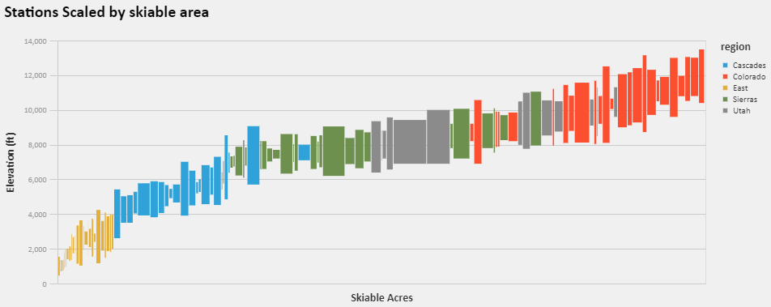
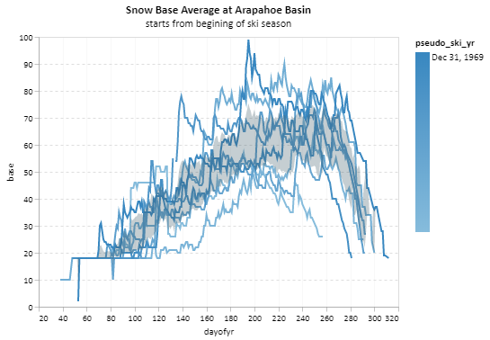
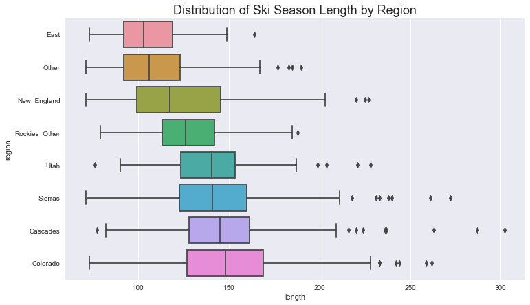
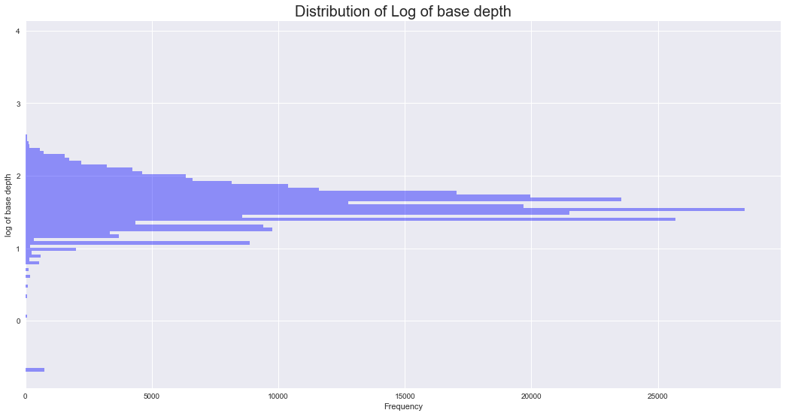
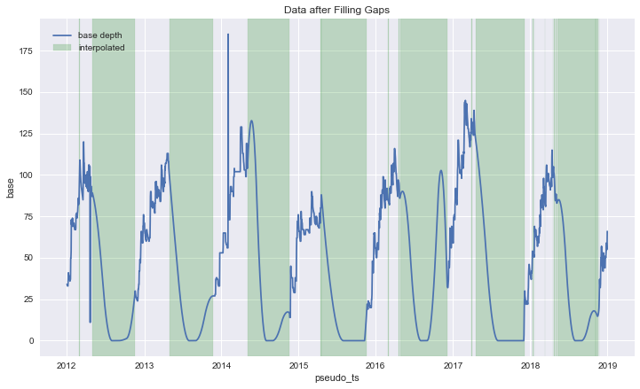
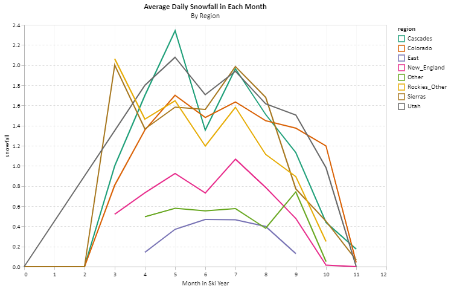
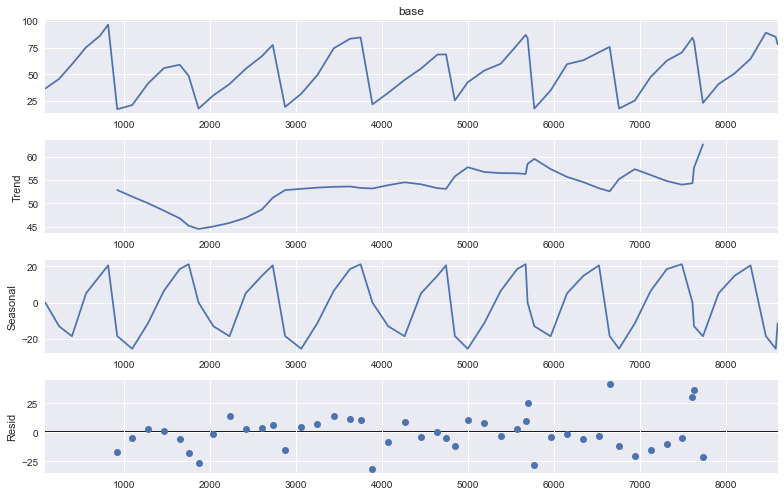
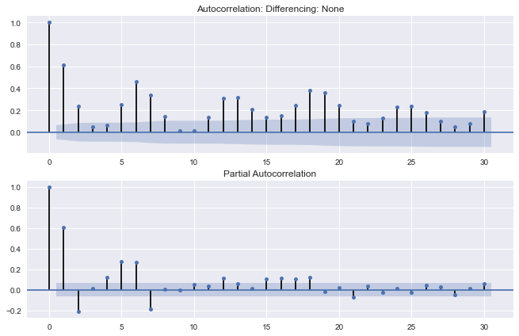
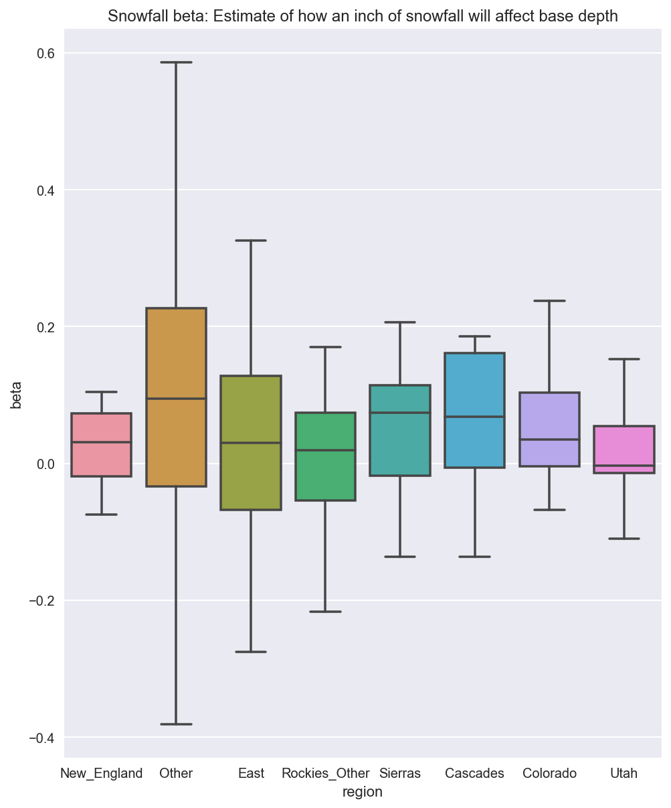

# ski-snow-modeling
Exploring the relationship between ski resort snowfall, base depth, and other features. 

### Description of Goals
EDA to see how ski resort snowfall, season length, base depth, etc. vary by region. Modeling: using altitude, location, etc to predict season length, and time series analysis of base depth evolution.
Tools: Scrapy, seaborn, altair (vega-lite visualizations), Numpy/Pandas etc., time series analysis with statsmodels (building to regression with SARIMA errors), tensorflow LSTM, FBProphet. Because prophet is somewhat difficult to install (dependencies on Stan and C++ compiler), I created a docker image of the install and am running it on AWS. 

### Files:
[./src/](./src/): elevation_scrapy.py scrapes basic data from wikipedia, station_list_ots.py scrapes list of stations from OTS, and ots_snow_scrapy_scraper.py scrapes the actual snowfall and base data from OTS. elevation_scrape_viz.ipynb explores and visualizes the scraped data.  
[./src/analysis/](./src/analysis/): snow_EDA_&_cleaning.ipynb does EDA, snow_ts_analysis.ipynb is classical e.g. ARIMA analysis, and TF-snow_ts_analysis.ipynb is the tensorflow model.  
[./src/prophet/](./src/prophet/) holds the dockerfile and notebook for the prophet model.

### From EDA including geographic data:
Data was scraped from wkikipedia (for geographic data including elevation) and OntheSnow.com (for time series data of snow fall and base depth by day.) Pandas and Scrapy were used for scraping. 

Elevation and Skiable Area, show lowest to highest elevation within each resort: 

Link to large plot of ski resorts, grouped by region, showing elevation and annual snowfall: [elevation by region](https://rawcdn.githack.com/chrisoyer/ski-snow-modeling/dbed27325d79cea4744d246df3ae58258a8025d4/resources/altitude_and_snowfall_by_region.html "Click for interactive version")

Example resort, A Basin. The base depth can be seen to be highly seasonal, with frequent jumps interspersed in an overall decrease (absent said jumps). Jumps should be powder days, and this is what I attempt to model. Note: 'pseudo_ts' is timestamp altered so all series within a regon are contiguous, to facilitate grouped analysis: 

Season length varied by region, with significant overlap 

### Data Cleaning
I windsorized values on the right tail at 2.5 standard deviations: there were some values in the original data where decimals were missing (eg 65 inches followed the next day by 655 inches of base); there were replaced by prior good value. 

Data cleaning issues included data non-randomly missing: the base and snowfall data is only reported when resorts are open. I assumed zero snowfall for unreported dates, assumed all dates in August had 0 base depth (which should hold for all but one or two locations in the US with glacier skiing), and used 2nd order polynomial interpolation in between season end and the summer zero values. 

 TODO: indicate filled values vs original)

Final average daily snowfall in each region by month: 

TODO: Regress features against season length, e.g. snowfall, region, altitude, etc. 

### Data cleaned for time series analysis and ARIMA style models explored. 

Typical decomposition plot, this one for Winter Park: 

Select model (choosing (p,d,q)(P,D,Q)s order terms): I'm working on setup of walk-forward crossvalidation of models. AIC/BIC based model selection works, but is suggesting different top models compared to traditional selection of terms based on AC/PAC plots. Plots look like this:
. 

For inference, I am currently using (0,1,1)(0,1,0)12 . The regression with SARIMA errors model includes snowfall as the exogenous variable. The betas for the snowfall variable for each resort are:  

Models still in progress: LSTM model in Tensorflow.  
Facebook Prophet GAM model. (dockerfile is working, modeling still in progress).

